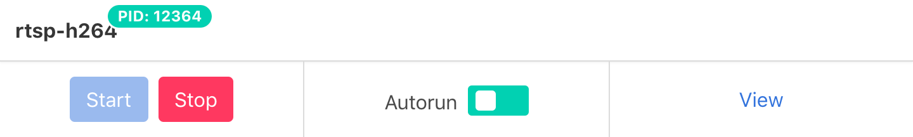
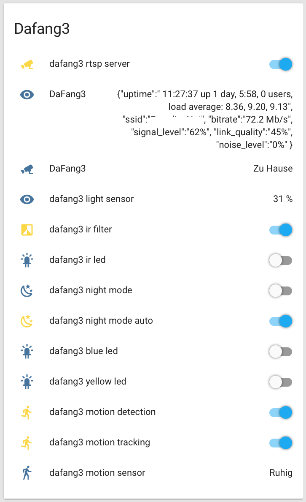
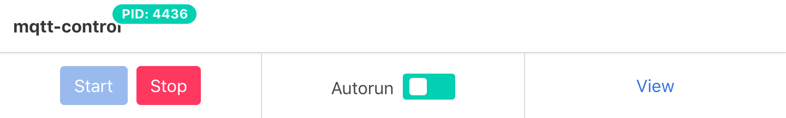
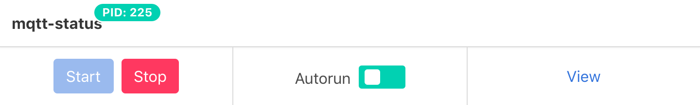

## Xiaomi Dafang Integration in Home Assistant

### On the Home Assistant side

First let's set up your camera stream. Make sure the _rtsp_ service in the _Services control panel_ is running and you can connect to it via a media player (like [VLC](https://www.videolan.org/)) using the address `rtsp://dafang:8554/unicast`.



Then you can integrate the RTSP stream using the [FFmpeg Camera component](https://www.home-assistant.io/components/camera.ffmpeg/) by adding the following lines to your `configuration.yaml`:

```yaml
camera:
  - platform: ffmpeg
    name: DaFang3
    input: -rtsp_transport tcp -i rtsp://dafang:8554/unicast
```

Alternatively, you can use the camera's CGI endpoint to serve a single picture using the [Generic IP Camera component](https://www.home-assistant.io/components/generic/). This is significantly lighter on the home assistant's CPU.

```yaml
camera:
  - platform: generic
    name: DaFang3
    username: root
    password: ismart12
    authentication: basic
    still_image_url: https://dafang/cgi-bin/currentpic.cgi
    verify_ssl: false
    scan_interval: 5
```

Most other sensors & actors are easily integrated via [MQTT Discovery](https://www.home-assistant.io/docs/mqtt/discovery/). If everything works, integration looks like this (grouped into one group):



To enable MQTT discovery in Home Assistant please add/adjust in your `configuration.yaml`:

```yaml
mqtt:
  broker: localhost
  discovery: true
  discovery_prefix: homeassistant
```

and restart your Home Assistant instance. MQTT works best if you [run your own broker](https://www.home-assistant.io/docs/mqtt/broker/#run-your-own). To make the camera work with Home Assistant's builtin MQTT broker set

```shell
MOSQUITTOOPTS="-V mqttv311"
```

in `mqtt.conf`.

### On the Xiaomi Dafang Camera side:

Connect to your camera via SSH (or your preferred FTP client):

```shell
ssh root@dafang # default password is ismart12
```

copy `/system/sdcard/config/mqtt.conf.dist` to `/system/sdcard/config/mqtt.conf`:

```shell
cp /system/sdcard/config/mqtt.conf.dist /system/sdcard/config/mqtt.conf
```

Set up your broker, LOCATION and DEVICE_NAME
and uncomment AUTODISCOVERY_PREFIX (only then the dafang configurations will be published):

```shell
vi /system/sdcard/config/mqtt.conf
```

Press `i` to enter insert mode. Once you are done hit `ESC` and enter `:wq` to write your changes.

Restart the mqtt-control & mqtt-status services in the _Services control panel_ to make them pick up on your changes.




 In case your Home Assistant needs to be restarted, changes are not persisted in any configuration file and the MQTT discovery configuration has to be resent from the camera. This can be enforced by restarting the mqtt-control service.

To put all the sensors & actors conveniently into one group you can use the following template:

```yaml
Dafang3:
    - camera.dafang3
    - switch.dafang3_rtsp_server
    - sensor.dafang3
    - device_tracker.dafang3
    - sensor.dafang3_light_sensor
    - switch.dafang3_ir_filter
    - switch.dafang3_ir_led
    - switch.dafang3_night_mode
    - switch.dafang3_night_mode_auto
    - switch.dafang3_blue_led
    - switch.dafang3_yellow_led
    - switch.dafang3_motion_detection
    - switch.dafang3_motion_tracking
    - camera.dafang3_motion_snapshot
    - binary_sensor.dafang3_motion_sensor
    - cover.dafang3_move_left_right
    - cover.dafang3_move_up_down
```

### To set up MQTT motion detection alerts:

copy `/system/sdcard/config/motion.conf.dist` to `/system/sdcard/config/motion.conf`:

```shell
cp /system/sdcard/config/motion.conf.dist /system/sdcard/config/motion.conf
```

Set up the motion detection via its [webinterface](http://dafang/configmotion.html).

In `motion.conf` define how your camera should react on motion events:

```shell
vi /system/sdcard/config/motion.conf
```

For your camera to send MQTT motion detection messages it should be enabled by setting:

```
publish_mqtt_message=true
```

To publish the image itself, also set

```
publish_mqtt_snapshot=true
```

You should now be getting messages on topic `myhome/mycamera/motion` and images on `myhome/mycamera/motion/snapshot/image` while `myhome/mycamera/motion/detection` is set to ON.

To react on a motion event, in your `automations.yaml` define something like:

```yaml
- id: '13370'
  alias: 'Motion detected'
  trigger:
    payload: 'ON'
    platform: mqtt
    topic: myhome/mycamera/motion
  action:
    service: notify.me
    data:
      title: "Motion"
      message: "detected."
```

For privacy reasons and to reduce the number of unwanted motion detections in surveillance applications,
you probably want to turn off motion detection when you or your family is home.

```yaml
- id: '13372'
  alias: 'Start motion detection when not at home'
  trigger:
    platform: zone
    event: leave
    zone: zone.home
    entity_id: device_tracker.your_device
  action:
    service: switch.turn_on
    data:
      entity_id: switch.mycamera_motion_detection

- id: '13373'
  alias: 'Stop motion detection when at home'
  trigger:
    platform: zone
    event: enter
    zone: zone.home
    entity_id: device_tracker.your_device
  action:
    service: switch.turn_off
    data:
      entity_id: switch.mycamera_motion_detection
```
